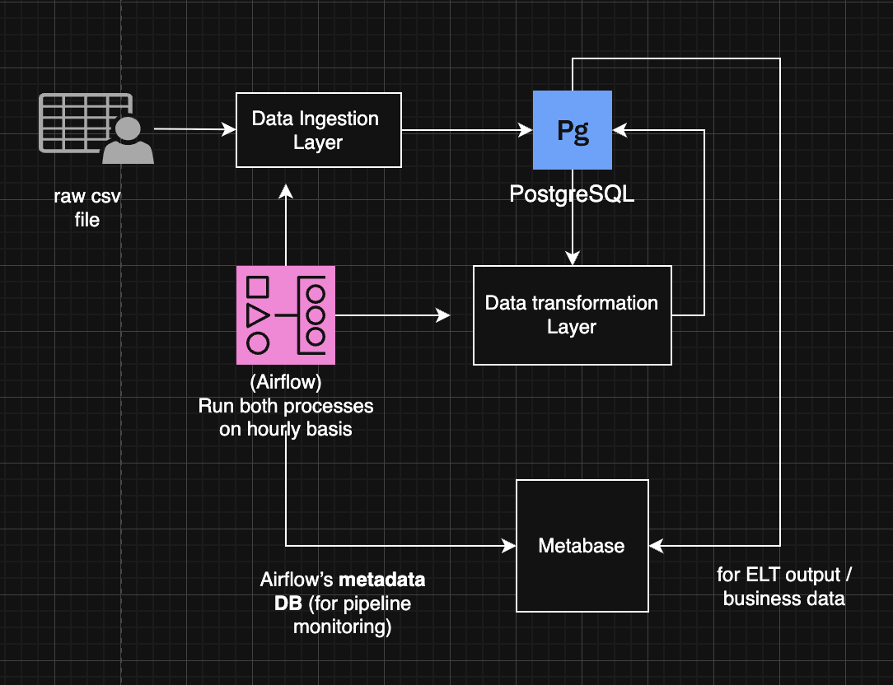
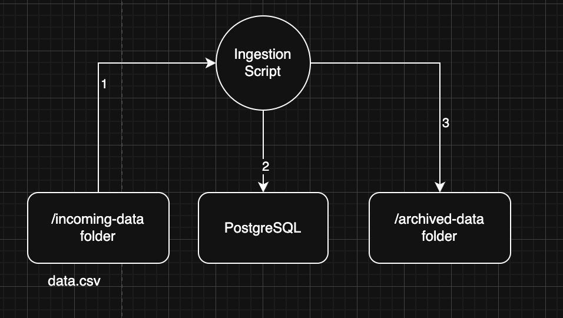
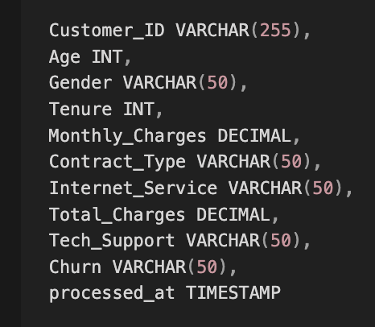
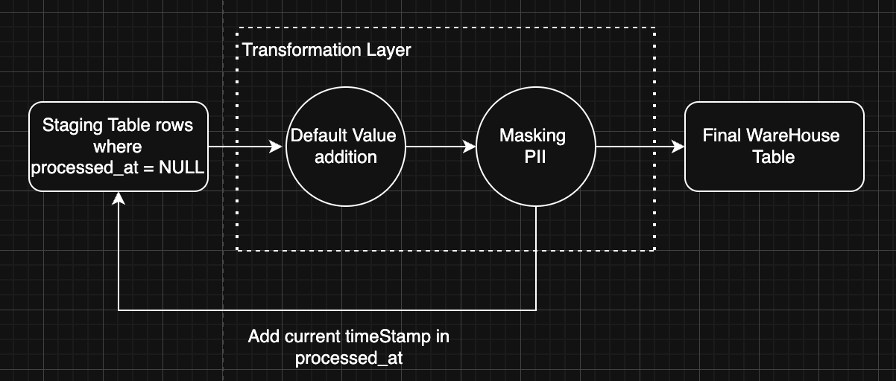
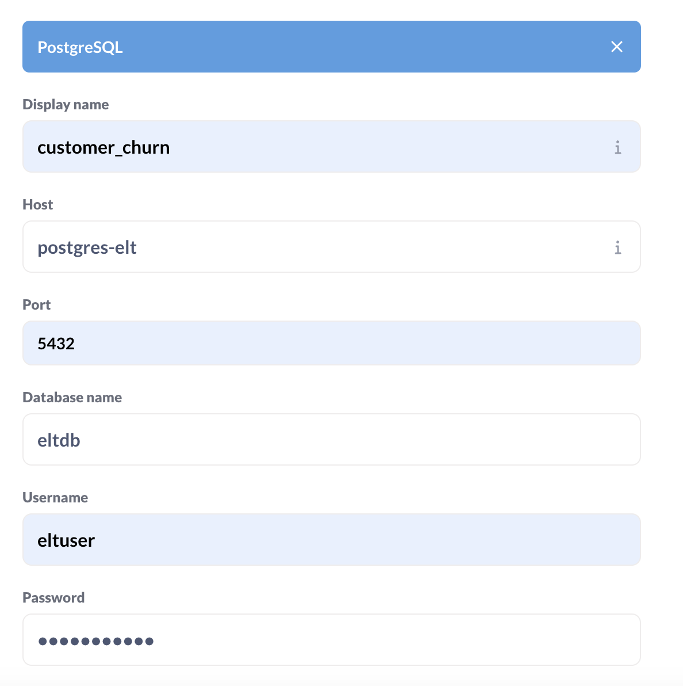
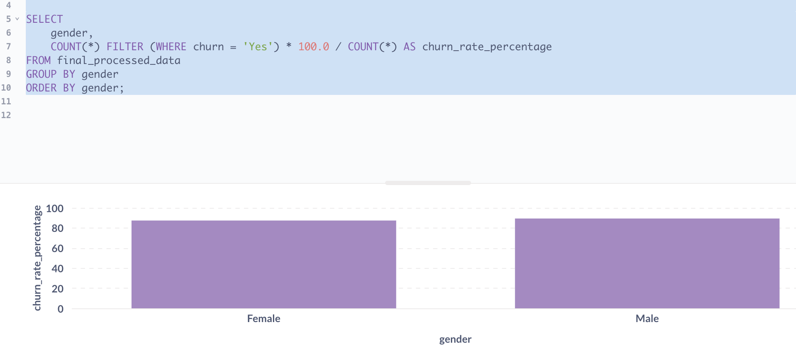

### High level Design : 



FLOW : 
1. We keep raw csv files in incoming-data folder which are taken up by data ingestion layer and inserted in postgresql. 
2. After data is ingested successfully, ingestion layer moves the csv files to archived-data folder. 
3. After the data ingestion layer work is completed, data transformation layer picks one row at a time from the staging table, masks the customer id and add default value for missing data. 
4. Each transformed row is finally inserted in the table working as final warehouse. 
5. Airflow runs both ingestion layer and transformation layer on a hourly basis.
6. Finally to create the dashboards on our warehouse and pipeline metric, we have connected both the warehouse and airflow's postgres server to Metabase.


### Ingestion LLD: 




### Staging Table Schema: 


We also have an index on processed_at for fast querying of unprocessed/new rows.


### Transformation Layer LLD: 


---

setup instructions: 

1. create venv in scripts folder and install from requirements:
```
cd scripts
python3 -m venv venv
source venv/bin/activate
pip3 install -r requirements
```

2. start docker compose:
```
docker-compose up -d
```

3. to view the DAG access localhost:8080

4. to create dashboard for our warehouse and FLOW details access localhost:3000

5. Add data.csv file in incoming-data folder.

6. To stop the containers:
```
docker-compose down -v
```


---

Configuration to connect Metabase to our warehouse table for analytics:



(get the password from docker-compose)


Finally we can create visulations in metabase like (churn rate based on gender) : 





